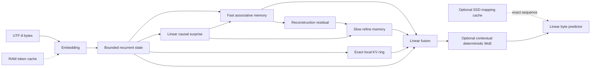

# Koemi-2OBOV

Koemi-2OBOV is a PyTorch training base for byte-level causal models built on
HERM (Hierarchical Error-Refined Memory): bounded recurrent state, fast and
slow associative memory, local exact recall and optional deterministic experts.

This repository contains architecture and training code. It does not ship a
trained model and does not claim Transformer-level quality.

## Problem

Large attention models spend memory and compute repeatedly processing context.
HERM keeps bounded fast and slow states for the running sequence, a small exact local buffer,
and an associative state that can be updated with a parallel affine scan.

## Install

Requirements: Python 3.11 or newer and pip.

```bash
python -m venv .venv
.venv/bin/python -m pip install --upgrade pip
.venv/bin/python -m pip install -e .
```

On Windows, replace `.venv/bin/python` with `.venv\Scripts\python`.

## Dataset contract

The loader accepts UTF-8 `.txt`, `.json` arrays and `.jsonl` files. A normalized record uses
this shape:

```json
{
  "id": "queue-001",
  "input": "Explain FIFO in one sentence.",
  "thinking": "A queue preserves arrival order.",
  "output": "FIFO means first in, first out.",
  "metadata": {"source": "example"}
}
```

`thinking` is optional. Its bytes receive a separate target mask and can be
weighted with `--thinking-loss-weight`. The mask does not claim that visible
thinking text is an internal reasoning trace.

For plain text, set `output` to `null`; the complete `input` becomes the causal
training sequence. Alpaca and ShareGPT records enter through validated adapters.

```bash
.venv/bin/python -m koemi inspect-dataset --dataset examples/canonical.jsonl
```

## Train

The default model has no expert bank, which is the lowest-cost path. CUDA is
selected by the CLI when available; use `--device cpu` for deterministic local
verification.

```bash
.venv/bin/python -m koemi train \
  --dataset examples/canonical.jsonl \
  --checkpoint artifacts/koemi-2obov.pt \
  --overwrite \
  --expert-count 2 \
  --thinking-loss-weight 2.0
```

Training logs separate answer loss/BPB from thinking loss, so a trace cannot
hide a regression in the answer tokens. They also contain loss, surprise,
valid-token count and expert activations. Validation loss/perplexity, optimizer
steps, learning rate, precision and tokens/s are reported. AdamW,
warmup/cosine decay, gradient accumulation, label smoothing and AMP are
configured through CLI flags. Example content is never logged.

## Generate

```bash
.venv/bin/python -m koemi generate \
  --checkpoint artifacts/koemi-2obov.pt \
  --prompt "FIFO means" \
  --max-new-bytes 64 \
  --cache-capacity 256 \
  --mapping-cache D:\\koemi-cache \
  --mapping-cache-namespace local-session \
  --mapping-cache-ttl-seconds 3600
```

The RAM cache reuses detached embeddings by token id. The optional mapping
cache stores the output and recurrent state for an exact input sequence under an
explicit tenant/session plus checkpoint namespace and content hash. Entries
expire under a sliding TTL and can be cleared only inside that namespace. It is
suitable for repeated identical prompts, not semantic similarity.

## Architecture



### HERM memory choices

HERM uses four decisions inspired by the memory perspective in [MIRAS](https://research.google/blog/titans-miras-helping-ai-have-long-term-memory/):

- memory architecture: bounded vector state, fast and slow normalized
  associative matrices and a fixed local key-value ring;
- attentional bias: key/query feature similarity and local dot-product recall;
- retention gate: bounded decay with a learned write gate;
- memory algorithm: differentiable outer training plus two affine prefix scans.

The current implementation is a research base, not a reimplementation of
Titans. The Google overview identifies Titans as a concrete architecture and
MIRAS as the broader framework; Titans uses a deeper online-updated neural
memory than HERM does.

For positive features `phi`, the fast tier reads
`B_t phi(q) / (z_t dot phi(q) + epsilon)` and updates with
`B_t = lambda_t B_(t-1) + w_t v_t phi(k_t)^T`. The slow tier receives the
bounded reconstruction residual `v_t - read_fast_t`, decays more slowly with
`lambda_s = 1 - (1 - lambda_t) rho`, and writes only in proportion to causal
surprise and local novelty. State remains fixed-width and both recurrences are
compatible with the same affine scan oracle.

### Surprise and chains

The previous recurrent state predicts the observed byte. Surprise is
`1 - exp(-NLL/log(256))`; it scales memory writes but never selects an execution
path. A carried `KoemiState` is the chain between generation steps; resetting it
starts a new session.

### Contextual deterministic MoE

When `--expert-count` is greater than zero, a stable hash of current byte,
previous byte and absolute position selects one expert. There is no risk head,
top-k selector, routing projection or routing loss. This partitions contexts
more finely than byte-only dispatch, but it is not learned semantic routing.

## Configuration

| Option | Default | Effect |
| --- | ---: | --- |
| `--embedding-size` | `64` | Width of token embeddings and recurrent state. |
| `--memory-features` | `16` | Width of associative memory features. |
| `--local-memory-size` | `16` | Number of exact local key-value slots. |
| `--expert-count` | `0` | Context-hash expert count; zero disables MoE. |
| `--cache-capacity` | `256` | Maximum RAM token embeddings. |
| `--scan-chunk` | `128` | Sequence bucket used by the parallel path. |
| `--refine-decay-rate` | `0.0625` | Slow-memory timescale relative to fast decay. |
| `--thinking-loss-weight` | `1.0` | Relative weight of supervised thinking bytes. |
| `--gradient-accumulation-steps` | `1` | Microbatches per optimizer update. |
| `--precision` | `auto` | FP32 on CPU; BF16 or FP16 AMP on supported CUDA. |
| `--validation-fraction` | `0.0` | Deterministic record-level holdout fraction. |
| `--num-workers` | `0` | DataLoader worker processes. |
| `--ablation` | `herm` | `herm`, `no_refine`, `no_surprise` or `affine` control. |
| `--device` | CUDA if available | PyTorch device used for training or generation. |
| `--execution-mode` | `parallel` | `parallel` scan or sequential correctness path. |

## Benchmark

```bash
.venv/bin/python benchmarks/run_benchmark.py --task bytes --report artifacts/bench-bytes-obov.json
.venv/bin/python benchmarks/run_benchmark.py --task recall --report artifacts/bench-recall-obov.json
.venv/bin/python benchmarks/run_ablation.py --task recall --seeds 17 29 41 --train-records 1024 --evaluation-records 1024 --epochs 4 --report artifacts/ablation-recall.json
```

The harness compares OBOV with parameter-matched GRU and LSTM baselines. The
old Koemi-1FPA measurements remain archived in [`docs/BENCHMARK.md`](docs/BENCHMARK.md)
and are not OBOV results. The ablation runner requires at least three seeds and
reports mean and standard deviation. The affine control is the minimum quality
baseline; a small-budget single-seed run is not evidence of memory capacity.

## Known limitations

- Contextual deterministic experts are not learned semantic routing. Learned
  expert selection would reintroduce a router, contrary to this architecture.
- The disk cache reuses exact hashed sequences only; “similar question” reuse
  needs retrieval and a similarity contract outside this phase.
- Disk entries contain recurrent state and logits and can encode prompt content.
  The cache is opt-in, requires an explicit namespace and provides TTL,
  namespace-local deletion and size/capacity limits. Payload encryption is not
  provided.
- SSD storage avoids recomputing an exact cached sequence but cannot replace
  GPU or RAM for arbitrary active computation; I/O latency can dominate on an
  HDD.
- There is no `asyncio` cognition scheduler or arbitrary layer offload. HERM's
  concurrency is tensor-level parallelism inside the causal scan window.
- The two associative tiers may still lose multi-key interactions. MQAR and
  long-context recall are still required.
- UTF-8 byte tokenization uses more positions than a learned tokenizer.
- No Triton kernel, distributed training, semantic retrieval, persistent
  episodic memory or tool use exists.

## Project layout

```text
src/koemi/
  configuration/  Model and training settings
  data/           JSON validation, adapters, serialization and tokenizer
  model/          HERM state, memory, cache, scan and deterministic MoE
  training/       Causal chunks, objective, trainer, checkpoint and generation
benchmarks/       OBOV against parameter-matched GRU and LSTM baselines
tests/            Data, model, cache, execution and training contracts
examples/         Valid JSON and JSONL inputs
```

## Test

```bash
.venv/bin/python -m unittest discover -s tests -v
```

## License

This project is licensed under the MIT License. See [LICENSE](LICENSE).
